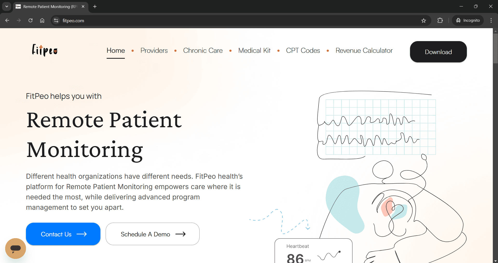
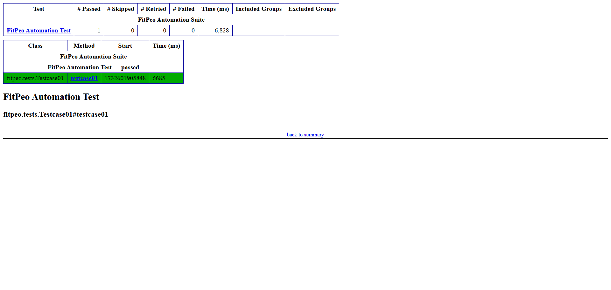
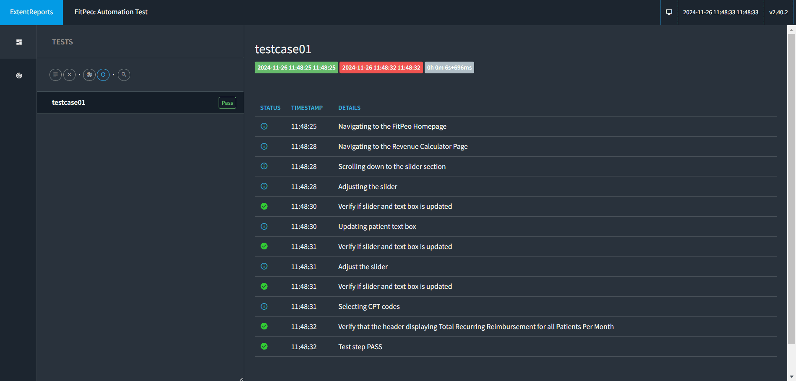

# FitPeo Automation
## Objective
* The objective of this project is to automate the navigation and interaction with web elements on the [FitPeo](https://www.fitpeo.com/) website.
* The automation covers various use cases related to navigating the homepage, interacting with the revenue calculator, and validating functionality such as:
    * Slider adjustments
    * Text field updates
    * Reimbursement value calculations

## Features Automated
* Navigate to the FitPeo Homepage
    * Open the web browser and navigate to the homepage.
* Navigate to the Revenue Calculator Page
    * From the homepage, navigate to the Revenue Calculator page.
* Scroll to the Slider Section
    * Scroll down to make the revenue calculator slider visible.
* Adjust the Slider
    * Adjust the slider to set its value to **`820`** and validate that the bottom text field updates accordingly.
* Update the Text Field
    * Modify the text field value to **`560`** and ensure the slider updates to reflect this value.
* Validate Slider Value
    * Verify that the slider and text field values match after updating the text field.
* Select CPT Codes
    * Scroll further and select the checkboxes for CPT codes:
        * **`CPT-99091`**
        * **`CPT-99453`**
        * **`CPT-99454`**
        * **`CPT-99474`**
* Validate Total Recurring Reimbursement
    * Verify that the "Total Recurring Reimbursement for all Patients Per Month" displays the expected value of **`$110,700`**.

## Technologies Used
* **Programming Language**: Java
* **Automation Tool**: Selenium
* **Test Framework**: TestNG
* **Build Tool**: Gradle

## Project Structure
```plaintext
|-- src
|    |-- main
|    |   |-- java
|    |   |   `-- fitpeo
|    |   |       |-- pages
|    |   |       |   |-- Home.java
|    |   |       |   `-- RevenueCalculator.java
|    |   |       `-- utilities
|    |   |           |-- Utils.java
|    |   |           `-- reports
|    |   |               |-- ExtentReportManager.java
|    |   |               `-- ExtentTestManager.java
|    |   `-- resources
|    `-- test
|        |-- java
|        |   `-- fitpeo
|        |       `-- tests
|        |           |-- Base.java
|        |           `-- Testcase01.java
|        `-- resources
|            |-- extentConfig.xml
|            `-- testng.xml
|-- build.gradle
```

## Setup and Run Instructions
### Prerequisites
* Java Development Kit (JDK) version 21 or higher: [Download JDK](https://www.oracle.com/in/java/technologies/downloads/)
* IDE: [Download Visual Studio Code](https://code.visualstudio.com/download)
* Gradle for build management: [Download Gradle](https://gradle.org/install/)
* Chrome Browser: [Download Chrome](https://www.google.com/intl/en_in/chrome/)
* Ensure the following dependencies are added to the build.gradle file:
    * [Selenium](https://mvnrepository.com/artifact/org.seleniumhq.selenium/selenium-java)
    * [TestNG](https://mvnrepository.com/artifact/org.testng/testng)
    * [Extent Reports](https://mvnrepository.com/artifact/com.relevantcodes/extentreports)

### Setup Steps
* Clone the repository or download the source code.
    * Clone via Git
        ```plaintext
        git clone https://github.com/devendraDPI/fitpeo-automation.git
        ```
    * Download the Source Code
        * [Download](https://github.com/devendraDPI/fitpeo-automation/archive/refs/heads/main.zip)
* Open the project in your IDE.
* Run below to download dependencies and build the project.
    ```plaintext
    gradle build
    ```

### How to Run the Tests
* To run the automated tests, execute the following command
  ```plaintext
  gradle test
  ```

## Expected Outputs
* All test cases should pass.

## Screenshots
### Application

> FitPeo: Home Page


> FitPeo: Revenue Calculator Page

### Reports
#### Emailable report

> Emailable report

#### Index report

> Index report

#### Extent report

> Extent report

## Video
* Watch the execution of the automated tests on YouTube

[](https://www.youtube.com/watch?v=XmMecvNgG9I "FitPeo Automation")
